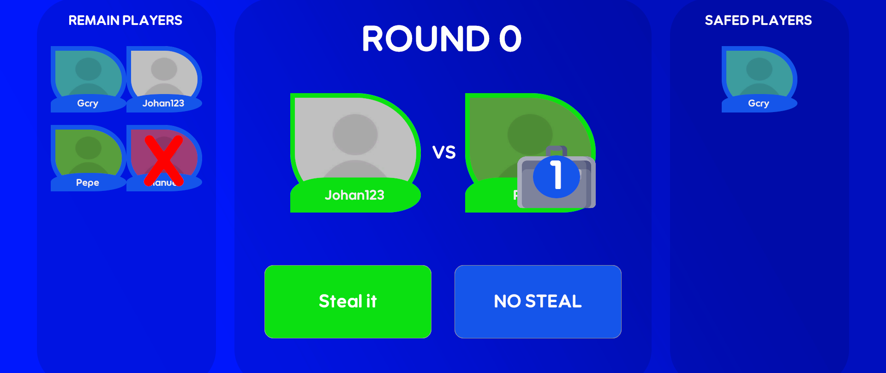

# STEAL OR NO STEAL GAME 💼
## What is this?

A technical demonstration of socket-based multiplayer interaction, Briefcase Duel is a simple game where players connect to a server and engage in a series of one-on-one duels. Each player chooses a briefcase that is randomly assigned a "SAFED" or "ELIMINATED" status, and their opponent must send a "steal" or "pass" command to the server. The server then resolves the outcome and sends the result back to the clients.
    <div style="display: flex; flex-wrap: nowrap;">
      
      
      
      
      
    </div>
## Features
* Create and enter salar
* Select rival and briefcase
* To steal or not to steal?
* Use powers 

## Technologies
### Server
* [Nodejs](https://nodejs.org/en) 
* [Express](https://expressjs.com/)
* [SocketIO](https://socket.io/)
### Client
* [Unity](https://unity.com/es)
* [UnitySocketIO](https://github.com/itisnajim/SocketIOUnity)

## How to run it.
### Server
Build Docker Image 
```bash
cd server
docker build --tag example-image .
```
Run Container
```bash
docker container run -d --name game-server example-image
```
### Client
Drop the assets folder in a new Unity project
